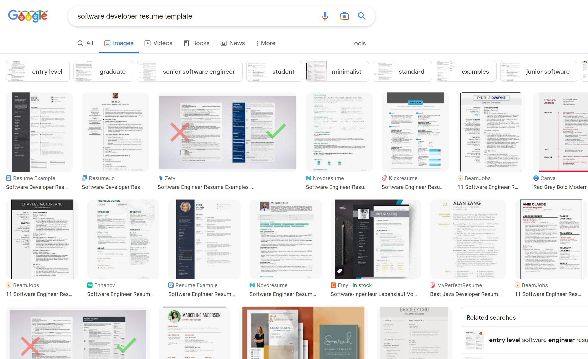

# 简历

### <mark style="background-color:green;">如何从零创建一份简历?</mark>

#### Step1: 找到好模板

SDE(Software development engineers)的简历风格都比较相似, 简历template可以直接去谷歌上搜索. 如果你熟悉[Latex](https://www.latex-project.org/), 直接导入网上优秀的Latex模板会很方便.

#### Step2: 关注各种SDE简历教程

TODO

#### Step3(Optional but recommended): 润色简历

可以通过以下渠道润色简历:

1. 大部分学校都会提供包含Lebenslauf Korrektur的免费求职帮助服务.
2. 各种简历润色网站, 但是质量收费参差不齐, 自行甄别.
3. 找熟人, 群里老哥帮忙.

### <mark style="background-color:orange;">怎么让别人看到我的简历?</mark>

善于利用领英. TODO
